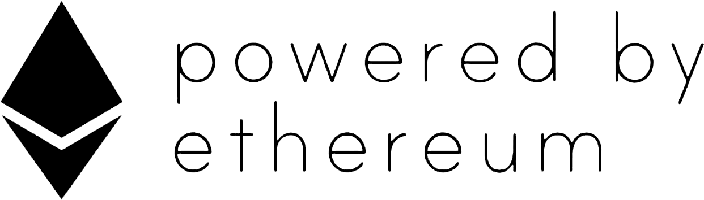
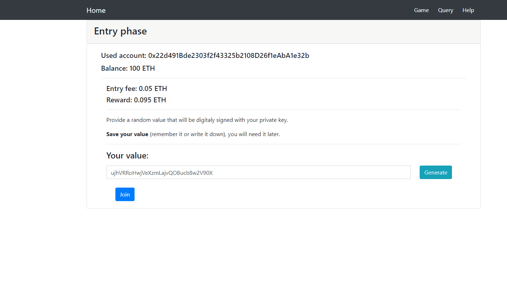
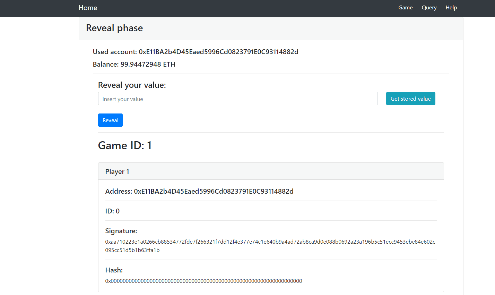
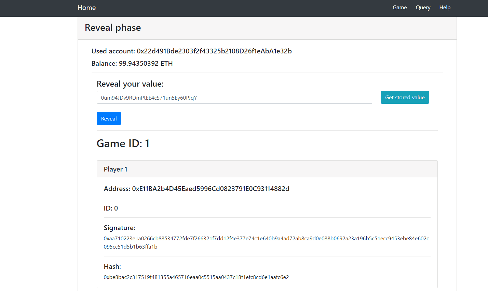
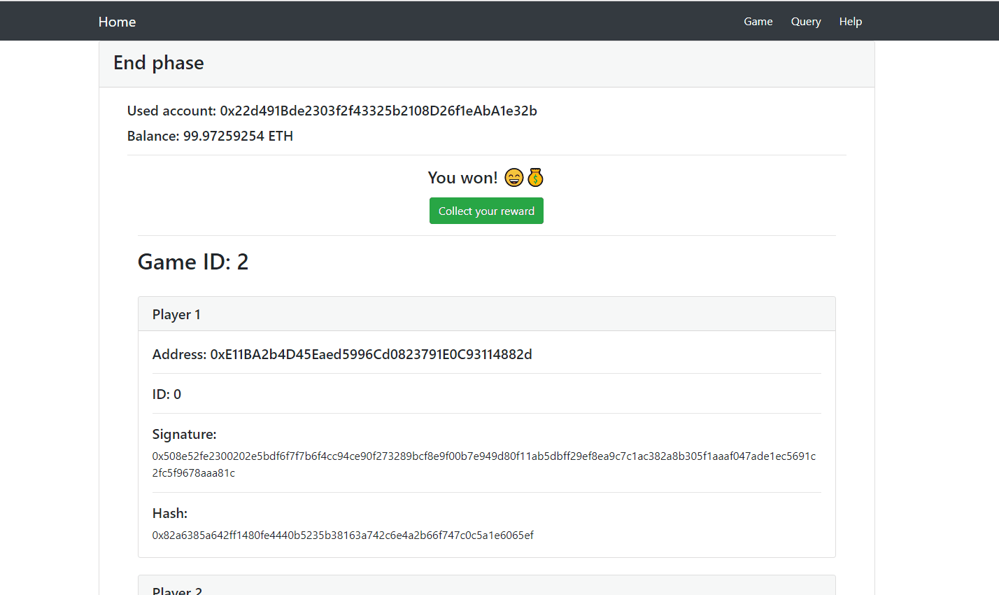

# Casino prism

Proof-of-Concept for a decentralized provably-fair casino powered by Ethereum.

## Made with:
- JavaScript
- NodeJs
- React
- Solidity
## How does it work
### Traditional implementations of online casino
- We are left to the blind faith in casino's fairness
-- For a user casino's functionality is encapsulated in a black box
- Casino can block a user
- Casino can freeze or steal user's money

### My implementation of online casino
Powered by Ethereum I built a casino based on commit-and-reveal scheme using digital signatures.
Choosing the winner is entirely left to the players. Casino has no influence on the outcome of a game.
Owner of the casino gets a fee from every game played on the contract.

### Gameplay flow
#### Entry phase
Each user digitaly signs a SHA-256 hash of a random value using his private key.
Each user pays an entrance fee and provides his signature.

#### Reveal phase
Each user reveals his initial value that has to match the provided signature.

player one:

player two:

#### End phase
We determine the winner from both provided values.

